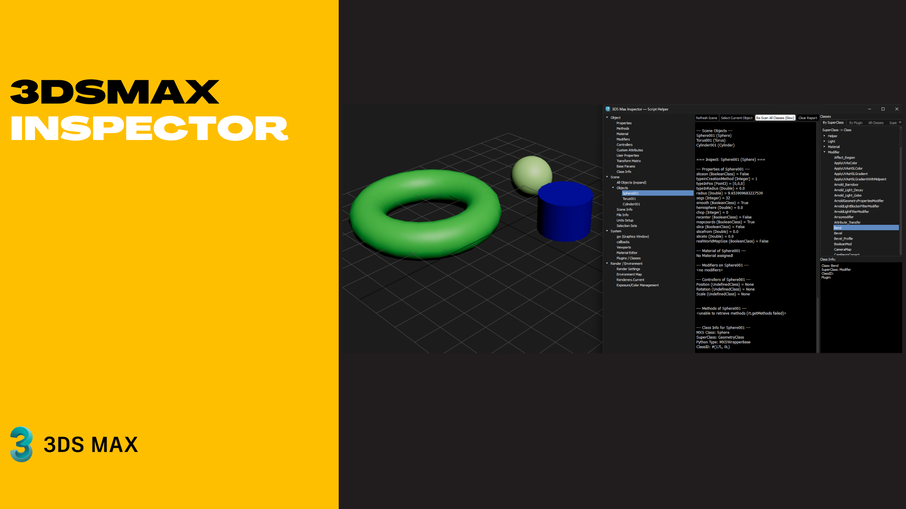

# 3ds Max Inspector (PySide6)

A powerful, user-friendly inspection tool for **Autodesk 3ds Max** developers and technical artists. Built with Python and PySide6, this tool allows you to explore scene objects, classes, plugins, and properties in real-time.

Developed by: **Iman Shirani**

---

## 🚀 Features
* **Scene Inspector:** Deep dive into object properties, methods, materials, modifiers, and controllers.
* **Class Browser:** Explore all available MaxScript classes categorized by SuperClass or Plugin.
* **Smart Caching:** Fast startup by caching scanned classes into a JSON file.
* **Clipboard Integration:** Double-click any class name to copy it instantly for your scripts.
* **System Info:** Quick access to Viewports, Render Settings, and Graphics Window (GW) properties.

## 🛠 Installation
1.  Ensure you have **3ds Max 2022+** (or any version supporting Python 3 and PySide6).
2.  Copy `3dsMaxInspector.py` to your 3ds Max scripts folder.
3.  Run the script via `Scripting -> Run Script...` or drag and drop it into the viewport.

## 🖥 Usage
* **Refresh Scene:** Updates the tree with current scene objects.
* **Re-Scan All Classes:** Performs a deep scan of all available 3ds Max classes (useful after installing new plugins).
* **Search:** Use the search bar in the "All Classes" tab to quickly find specific classes.

## 🤝 Support & Donation
If you find this tool helpful, consider supporting the development:
* **PayPal:** 

## 📄 License
MIT License - Feel free to use and modify for your professional or personal projects.

**Author:** Iman Shirani  
**Version:** 0.0.1
